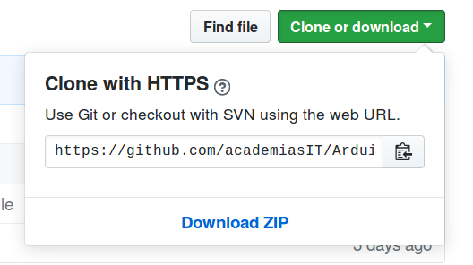
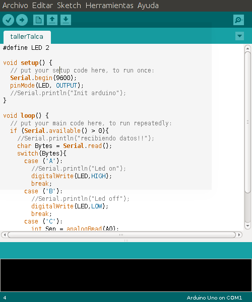


# Taller de IoT con Arduino y Raspberry
## Resumen
Este taller consiste en una experiencia en donde un arduino, el cual tiene conectado un led y un potenciometro, es controlado mediante una Raspberry Pi. La Raspberry tiene un led directamente conectado a su GPIO.

El control y supervisión de estos dispositivos se realiza mediante un servicio de IoT llamado [ubidots](https://app.ubidots.com/accounts/signin/). Toda la programación esta hecha en Python y Arduino (C++).

## Instrucciones
1. Descargar el proyecto [Aqui](https://github.com/academiasIT/Arduino_Raspberry_IoT/) presionado el botón verde llamado "Clone or download" y seleccionado "Download as Zip", como se muestra a continuación:
 

 O también clonando el proyecto utilizando Git: `git clone https://github.com/academiasIT/Arduino_Raspberry_IoT.git`.

2. Realizar las conexiones descritas en la siguiente figura
 

3. Luego conectar el Arduino mediante un cable USB al computador en donde se descargo el proyecto. Abrir el IDE de Arduino y cargar el archivo llamado tallerTalca.ino existente en el proyecto comose muestra en la figura.

  

 Configurar el IDE de Arduino con la tarjeta correcta (Herramientas->Tarjeta->Arduino uno) y el puerto de comunicaciones correspondiente en cada caso particular (Herramientas->Puerto->COM*X*), finalmente pinchar el boton "subir"  del IDE para grabar el programa en el Arduino.

4. crear una cuenta en  [ubidots](https://app.ubidots.com/accounts/signin/), luego crear un dispositivo con tres variables (una para el potenciometro, otra para el led de arduino y la última para el led de la raspberry), luego crear un dashboard con dos switch (uno para cada led) y un indicador tipo "gauge" para el potenciometro.
5. conectar por SSH a la raspberry, descargar el proyecto (preferentemente con git)
6. descargar e instalar la librerias RPi.GPIO y de Ubidots en la Raspberry.
7. editar con el programa nano el script script_rpi.py, cambiando el tokjen y tags de las variables de ubidots por las propias de sus cuentas.
